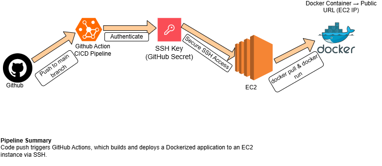
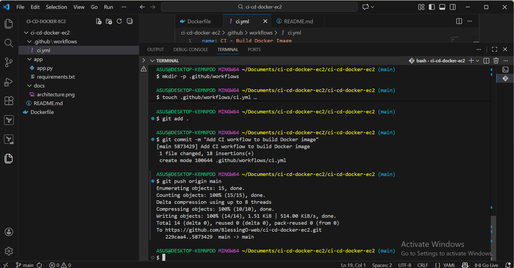

# CI/CD Docker Deployment to AWS EC2

This project demonstrates a simple end-to-end CI pipeline that builds a Docker image for a Flask application using GitHub Actions, with the goal of deploying the containerized app to AWS EC2.

The focus of this repository is to show:
- Clean project structure
- Dockerizing a Python Flask app
- Automated Docker image build using CI
- Real-world DevOps workflow fundamentals

---

## Project Overview

The application is a lightweight Flask web app packaged into a Docker container.  
Whenever code is pushed to the repository, GitHub Actions automatically builds the Docker image to validate that the application is container-ready.

---

## 🧱 Architecture Diagram

The diagram below shows how the CI/CD workflow operates from code push to Docker image build.

## Architecture Diagram 

---

## Project Structure

---

## CI Pipeline Status

 
## Author

Blessing Ogbonna  
Cloud & DevOps Engineer
